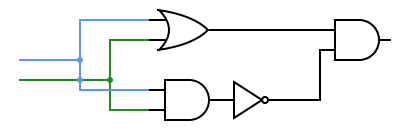

## Logic gates

- [Logic gates](#logic-gates)
  - [Some things to note](#some-things-to-note)
  - [AND gate](#and-gate)
    - [Symbol](#symbol)
    - [Description](#description)
    - [Truth table](#truth-table)
  - [OR gate](#or-gate)
    - [Symbol](#symbol-1)
    - [Description](#description-1)
    - [Truth table](#truth-table-1)
  - [NOT gate](#not-gate)
    - [Symbol](#symbol-2)
    - [Description](#description-2)
    - [Truth table](#truth-table-2)
  - [Nand gate](#nand-gate)
    - [Construction](#construction)
    - [Symbol](#symbol-3)
    - [Description](#description-3)
    - [Truth table](#truth-table-3)
  - [NOR gate](#nor-gate)
    - [Construction](#construction-1)
    - [Symbol](#symbol-4)
    - [Description](#description-4)
    - [Truth table](#truth-table-4)
  - [XOR gate](#xor-gate)
    - [Construction](#construction-2)
    - [Symbol](#symbol-5)
    - [Description](#description-5)
    - [Truth table](#truth-table-5)

### Some things to note

-   `True` is the same as `1`
-   `False` is the same as `0`
-   The truth tables are for the minimum number of inputs for the gate

### AND gate

#### Symbol

#### Description
-   This gate outputs `true` only if all the inputs are `true` and `false` otherwise
-   Takes two or more inputs

#### Truth table

| Input 1 | Input 2 | Output |
| ------- | ------- | ------ |
| True    | True    | True   |
| True    | False   | False  |
| False   | True    | False  |
| False   | False   | False  |

### OR gate

#### Symbol

#### Description
-   This gate outputs `true` if atleast one of it's input is `true` and `false` otherwise
-   Takes two or more inputs

#### Truth table

| Input 1 | Input 2 | Output |
| ------- | ------- | ------ |
| True    | True    | True   |
| True    | False   | True   |
| False   | True    | True   |
| False   | False   | False  |

### NOT gate

#### Symbol

#### Description
-   Also known as the **inverter**
-   This gate changes the input to it's opposite
-   Takes exactly one input

#### Truth table

| Input | Output |
| ----- | ------ |
| True  | False  |
| False | True   |

### Nand gate

#### Construction

#### Symbol

#### Description
-   It is constructed by placing a `not` gate directly on the output of an `and` gate
-   Naming: NOT+AND = Nand
-   This gate outputs `false` only if all the inputs are `true` and otherwise `true`
-   Takes two or more inputs

#### Truth table

| Input 1 | Input 2 | Output |
| ------- | ------- | ------ |
| True    | True    | False  |
| True    | False   | True   |
| False   | True    | True   |
| False   | False   | True   |

### NOR gate

#### Construction

#### Symbol

#### Description
-   It is constructed by placing a `not` gate directly on the output of an `or` gate
-   Naming: NOT+OR = NOR
-   This gate outputs `true` if atleast one of it's input is `false` and `false` otherwise
-   Takes two or more inputs

#### Truth table

| Input 1 | Input 2 | Output |
| ------- | ------- | ------ |
| True    | True    | False  |
| True    | False   | False  |
| False   | True    | False  |
| False   | False   | True   |

### XOR gate

#### Construction

#### Symbol

#### Description
-   Same as the `OR` gate but returns `true` only when atleast one input is `false`
-   Naming: short for eXclusive-OR
-   This gate outputs `true` if atleast one of it's inputs is `false` and `false` otherwise
-   Takes two or more inputs

#### Truth table

| Input 1 | Input 2 | Output |
| ------- | ------- | ------ |
| True    | True    | False  |
| True    | False   | True   |
| False   | True    | True   |
| False   | False   | False  |

